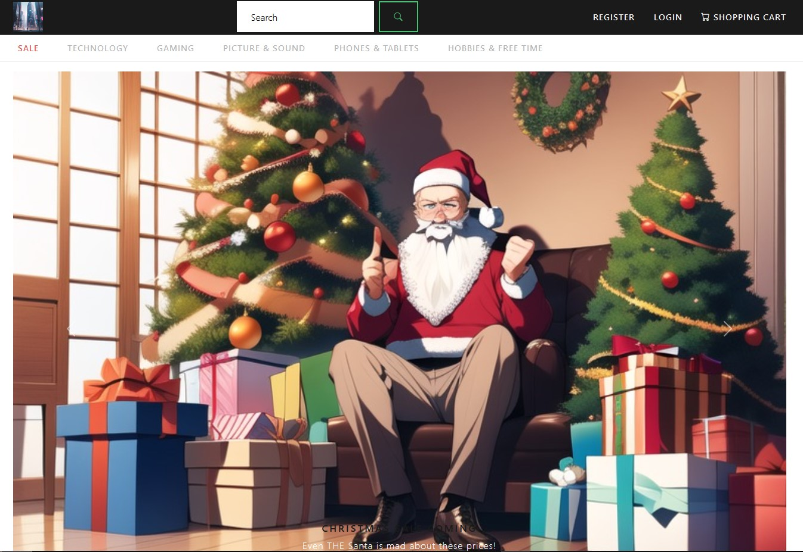
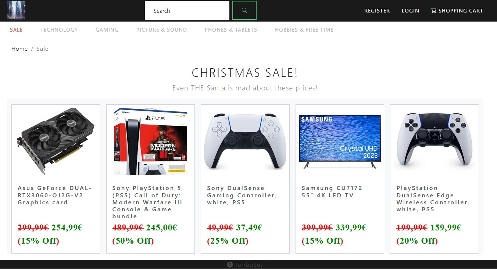
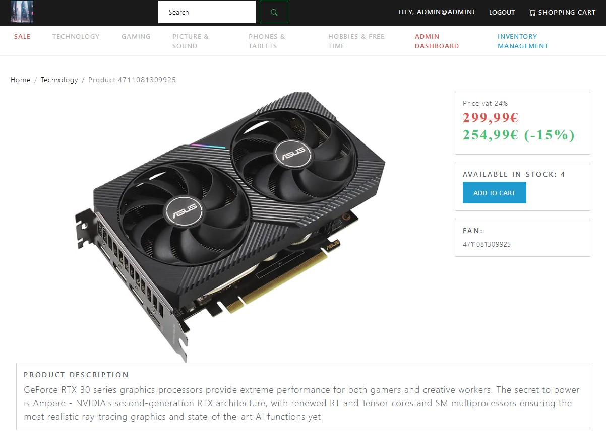
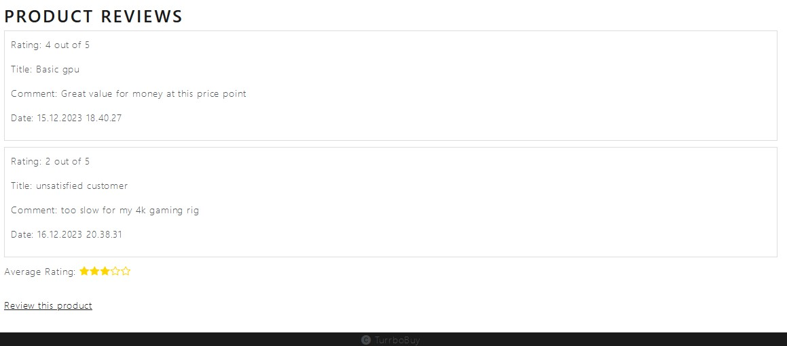
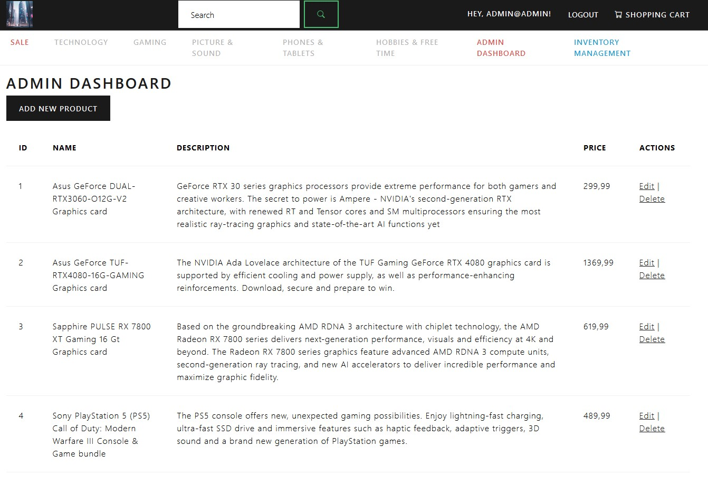
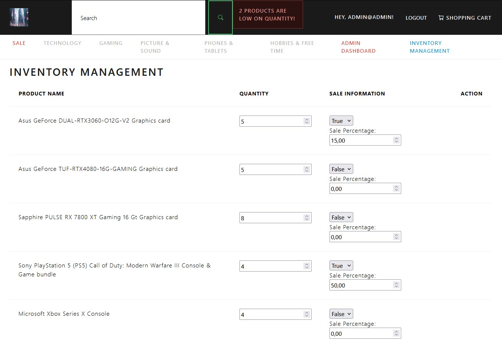
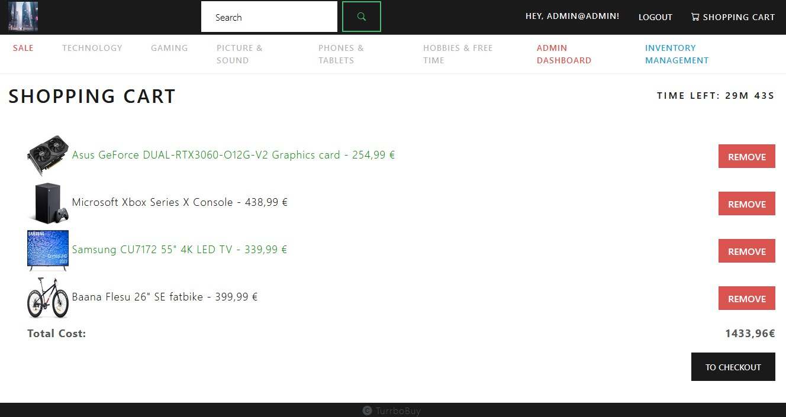
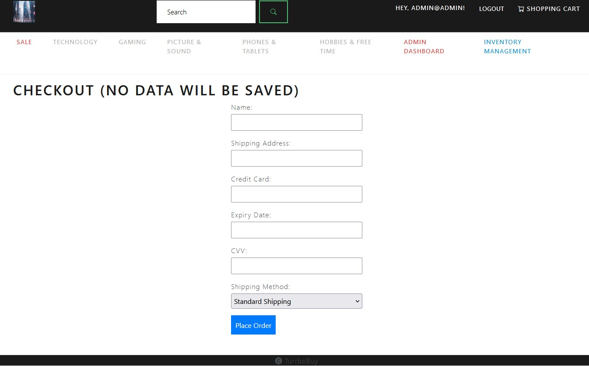

Matias Kauranen, Juhani Koski, Antti Kurkinen, Arttu Kääriäinen  
Degree Programme in Information Technology (Oamk)  
(ID00BQ11 | TVT21SPO)

# Turrbobuy - E-Commerce Platform

## Presentation
Turrbobuy is a feature-rich E-Commerce platform designed to provide users with a seamless and enjoyable online shopping experience. Whether you're a customer looking for the latest products or an administrator managing the inventory, Turrbobuy has you covered.

  

> **Picture 1**. Application main page, at top you can see different product catalogues. From top nav bar user can use search bar and navigate to login, register or shopping cart page.
  

  

> **Picture 2**.  Catalogue page "Sale" where are all products that are currently on sale.
  

  

> **Picture 3**.  Product details page in which product details: name, description, quantity, and price is shown. Pressing "ADD TO CART" button places product in shopping cart page.  Also notice "Admin Dashboard" and "Inventory Management" buttons that are only visible to administrator.
  

  

> **Picture 4**.  Bottom half of product details page. Logged in users can leave reviews on products. Average rating is calculated from given reviews and is displayed with golden stars.
  

## Features
- **User-Friendly Interface:** Intuitive and easy-to-navigate design for a delightful shopping experience. 
- **Product Categories:** Explore a wide range of products categorized for quick and convenient browsing. 
- **Secure Authentication:** Robust user authentication with optional multi-factor authentication for enhanced security. 
- **Shopping Cart:** Add and manage products in your cart before making a purchase. 
- **Admin Console:** Administrators can efficiently manage inventory, track orders, and more. 
- **Search Functionality:** Quickly find products with a powerful search feature. 
- **Responsive Design:** Access Turrbobuy seamlessly on various devices, ensuring a consistent experience. 

  

> **Picture 5**.  Admin dashboard page in which admin can create, edit or remove products.
  

  

> **Picture 6**.  Inventory management page in which admin can modify product quantaties and also put products on sale at certain sale percentage (See picture 2). Notice alert at top nav bar if there are products with low quantity.
  

## Technologies
- **ASP.NET Core:** Backend framework for building robust and scalable web applications.
- **Entity Framework Core:** ORM for interacting with the database.
- **Bootstrap:** Frontend framework for responsive and modern UI design.
- **Azure SQL Server:** Relational database management system for data storage.
- **HTML/CSS:** Standard technologies for web development.

  

> **Picture 7**.  Shopping cart page where customer can see all their products they added to their cart. User can remove products from cart with "Remove" button. Shopping cart calculates total cost and notices if product is on sale (green ones). There is 30 minutes timer that starts when first product is added to cart, and if time runs out cart is reset. Theres also "TO CHECKOUT" button that takes to checkout.
  

  

> **Picture 8**.  Checkout page where customer can fill their order information. No personal data is saved. After user presses "Place Order" they will be taken to "Thanks for order" page and then shopping cart is reset.
  

## Demo
Check out our live demo here to experience Turrbobuy in action. Feel free to explore the features and functionalities. 
[Link to Demo](https://online-store-app20231108162725.azurewebsites.net)
